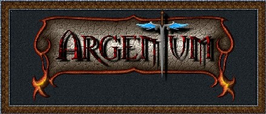

# AoSpain - Proyecto Argentum Online (32-bit Engine)

**AoSpain** es un proyecto basado en el motor clásico de **Argentum Online**, profundamente optimizado y modernizado para soportar arquitecturas de **32 bits (Long)**. Esta mejora rompe los límites históricos de 16 bits (32k), permitiendo bases de datos de objetos, gráficos y mapas virtualmente ilimitadas.

## 🚀 Mejoras Recientes (22-23 de Marzo, 2026)

* **Sistema de Borrado de Personajes (Optimizado):**
    * **Limpieza de Interfaz:** Implementada la función `LimpiarPJsCuentas` que resetea los slots y PictureBoxes en `frmCuent`, eliminando el error visual de personajes "fantasma" tras el borrado o cambio de cuenta.
    * **Refresco en Tiempo Real:** El servidor ahora reenvía automáticamente la lista actualizada de personajes tras un borrado exitoso (`BORROK`), permitiendo que el cliente se actualice instantáneamente sin necesidad de desconectar.
    * **Corrección de Índices:** Reparada la función `TienePjs` y el reordenamiento de la lista en el archivo `.act`, asegurando que los personajes ocupen siempre los slots correctos (del 1 al N) sin huecos ni duplicados.
* **Renderizado en HDC:** Implementada la función `GrhRenderToHdc` en el motor gráfico, permitiendo el dibujo de personajes y gráficos directamente en controles de Windows (PictureBox), resolviendo el fallo visual en el panel de cuentas.
* **Protocolo de Creación Corregido:** Reparado el paquete `NLOGIN`. Ahora se envían y procesan correctamente los atributos y habilidades elegidos, eliminando el error de campos desplazados.
* **Integración de Cuentas Real:** El sistema ahora vincula automáticamente el email real de la cuenta (.act) a los nuevos personajes, eliminando correos genéricos hardcodeados.
* **Estabilidad de Conexión:** Mejorada la lógica de reconexión en `frmCuent`. El cliente ahora asegura una conexión limpia y espera síncronamente al servidor antes de enviar datos, eliminando errores de socket (24038, 24057).
* **Compatibilidad 32-bit:** Actualizadas funciones de dibujo heredadas (`DrawGrhtoHdc`) para soportar índices `Long`, garantizando la estabilidad tras la migración del motor.
* **Comando /salir:** Corregido el flujo de descarga de formularios para evitar solapamientos y asegurar el retorno correcto al panel de selección de personajes.

## 👥 Sistema de Cuentas (Completado y Estable)

Sistema multicharacter (1 cuenta -> N personajes) completamente implantado y depurado según `Sistemacuentas_implantar.txt`.

* **Servidor:** `ConnectNewUser` y `ConnectUser` soportan parámetro `Cuenta`; `Case "BORR"` elimina PJ de la cuenta (.act) y reordena lista; función `CuentaExiste` añadida.
* **Cliente:** Formularios de gestión de cuentas (`frmCuent`, `frmCrearAccount`, `frmRecuperar`, `frmCambiarPass`) y envío/recepción de paquetes (`ALOGIN`, `OOLOGI`, `NACCNT`, `NLOGIN`, `INIAC`, `ADDPJ`, `RECCUU`, `REECUU`, `PEDPRE`, `GENPAS`, `REPASS`, `BORR`).
* **Persistencia:** Archivos `.act` en `Servidor/Accounts/` con lista de personajes por cuenta; `.gitignore` actualizado.
* **Seguridad:** Contraseñas de cuenta almacenadas en campo `AccountedPass`.
* **Flujo de Login:**
  * **Cuentas sin personajes:** Servidor envía `INIAC0` → Cliente muestra `frmCuent` con opción de crear PJ.
  * **Cuentas con personajes:** Servidor envía `INIAC` + `ADDPJ` → Cliente muestra `frmCuent` con lista de PJs existentes.
  * **Manejo de Errores:** Cliente procesa mensajes `ERR` sin colgarse, permitiendo reintentar operaciones.

## 🏗️ Motor de 32 bits (Migración Long)

Se ha realizado una migración quirúrgica en el Cliente y el Servidor, cambiando los índices críticos de `Integer` a `Long`.

* **Gráficos e Índices:** Soporte para más de 2 mil millones de IDs de gráficos y animaciones.
* **Objetos y Comercio:** Solución definitiva al bug de pérdida de oro al comerciar más de 32,767 monedas.
* **Renderizado (DirectX 7):** Optimización del `TileEngine` para evitar desbordamientos en mapas de alta densidad.

### 🛠️ Herramientas Modernas

Incluye la herramienta **ConversorGrh** desarrollada en **.NET 8**, diseñada para:

* Convertir índices (`.ind`) y mapas (`.map`) de 16 bits a 32 bits.
* Visualizar y exportar datos a formato `.dat` con codificación ANSI (Windows-1252).

### 🛡️ Seguridad y Red

* **Protocolo de Red:** Comunicación optimizada con sistema de CRC dinámico para prevenir bots.
* **Seguridad:** Hashing de contraseñas mediante MD5 y clave de aplicación secreta.
* **Handshake:** Sistema de desafío/respuesta (`ValCoDe`) para asegurar que solo el cliente oficial pueda conectarse.

## 📁 Estructura del Proyecto

* `/Cliente`: Código fuente en Visual Basic 6 (Engine de 32 bits).
* `/Servidor`: Lógica central, gestión de usuarios y NPCs (.bas).
* `/Herramientas`: Utilidades de desarrollo en .NET 8.
* `/mejoras_arquitectura.md`: Documentación detallada de la migración técnica.

## 🛠️ Requisitos de Instalación

1. **Cliente/Servidor:** Visual Basic 6.0 con librerías registradas (`CSWSK32.OCX`, `MSINET.OCX`, etc.).
2. **Librerías de Sonido:** `dx7vb.dll` y `Bass.bas`.
3. **Herramientas:** Runtime de **.NET 8.0**.

## ⚖️ Licencia

Este proyecto está bajo la licencia **GNU General Public License v3.0**. Consulta el archivo `LICENSE` para más detalles.

---
*Desarrollado y mantenido por la comunidad de AoSpain.*
