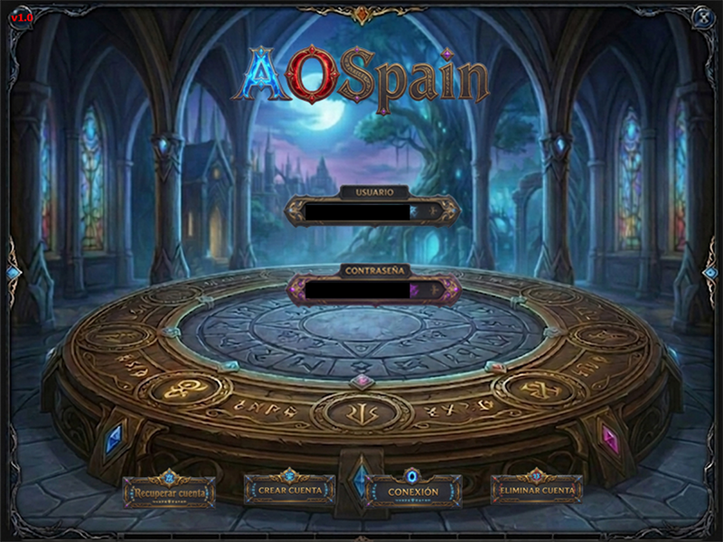

# AoSpain - Proyecto Argentum Online (32-bit Engine)

**AoSpain** es un proyecto basado en el motor clásico de **Argentum Online**, profundamente optimizado y modernizado para soportar arquitecturas de **32 bits (Long)**. Esta mejora rompe los límites históricos de 16 bits (32k), permitiendo bases de datos de objetos, gráficos y mapas virtualmente ilimitadas.

## 🚀 Mejoras Recientes (Marzo 2026)

* **Sistema de Cuerpos y Cabezas Dinámico:**
    * **Vista Previa de PJ Completo:** Implementada la renderización en tiempo real del cuerpo y cabeza seleccionados durante la creación, con visibilidad inteligente de controles solo tras elegir raza y sexo.
    * **Carrusel de Selección:** Actualizado `frmCrearPersonaje` con previsualización de 5 cabezas y rotación de 360 grados.
    * **Configuración Externa:** Los rangos de cabezas se cargan desde `Cabezas.ini`, eliminando límites fijos en el código.
* **Gestión de Cuentas Avanzada (10 Slots):**
    * **Capacidad Máxima:** Soporte completo para hasta 10 personajes por cuenta con renderizado dinámico e independiente para cada slot.
    * **Interfaz Optimizada:** Selección de personajes con feedback visual (resaltado dorado) y lógica de conexión centralizada para mayor estabilidad.
* **Sistema de Borrado de Personajes (Optimizado):**
    * **Refresco en Tiempo Real:** El servidor reenvía la lista actualizada tras un borrado exitoso, permitiendo la actualización instantánea sin desconexión.
* **Renderizado en HDC:** Implementada la función `GrhRenderToHdc`, permitiendo el dibujo de personajes y gráficos directamente en controles de Windows (PictureBox).
* **Compatibilidad 32-bit:** Actualizadas todas las funciones de dibujo heredadas para soportar índices `Long`.

## 🏗️ Motor de 32 bits (Migración Long)
Se ha realizado una migración quirúrgica en el Cliente y el Servidor, cambiando los índices críticos de `Integer` a `Long`.
* **Gráficos e Índices:** Soporte para más de 2 mil millones de IDs de gráficos y animaciones.
* **Objetos y Comercio:** Solución definitiva al bug de pérdida de oro al comerciar más de 32,767 monedas.

### 🛡️ Seguridad y Red
* **Protocolo de Red:** Comunicación optimizada con sistema de CRC dinámico.
* **Seguridad:** Hashing de contraseñas mediante MD5 y clave de aplicación secreta.
* **Handshake:** Sistema de desafío/respuesta para asegurar el cliente oficial.

## 📁 Estructura del Proyecto
* `/Cliente`: Código fuente en Visual Basic 6 (Engine de 32 bits).
* `/Servidor`: Lógica central y gestión de usuarios.
* `/Herramientas`: Utilidades de desarrollo en .NET 8 (ConversorGrh).

---
*Desarrollado y mantenido por la comunidad de AoSpain.*
